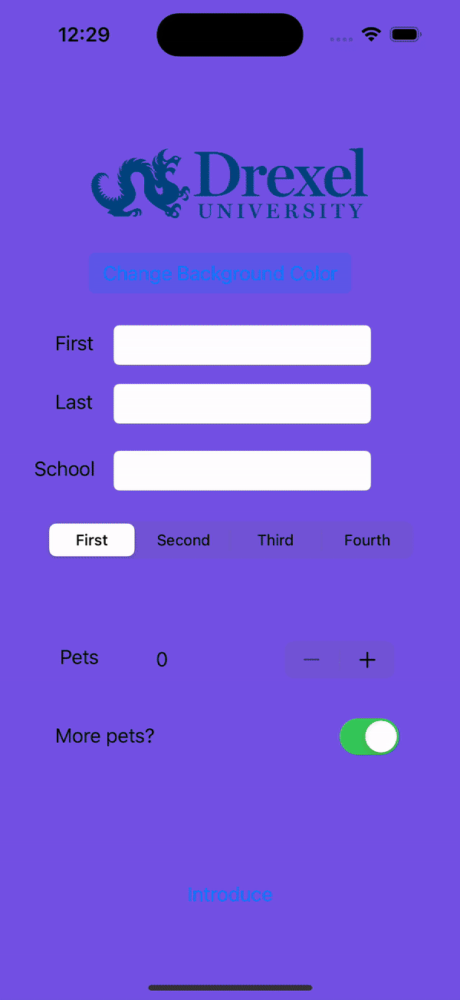

## Introduction App

### App Description

An introduction app that asks for the user's first and last name and the university that they go to. It also has an additional pet counter and a switch to determine if user wants more pets. There are two buttons, one that changes background color and one that generate an introduction for the user. 

### App Walk-though

### Required Features

- [x] 1. App displays an image of a school's logo
- [x] 2. App has three textfields for first, last, and school names
- [x] 3. App has a segmented control that changes student year
- [x] 4. Number of pet matches label is increased/decreased by stepper
- [x] 5. Switch makes a statement about wanting more pets or not(true/false) 
- [x] 6. Introduce yourself button shows alert box with an introduciton and dismiss button

### Optional Features

- [x] 1. User can tap a button to change the color of the background view
- [ ] 3. User can select on additional buttons that provide more info about the user. Example: more textfields, a different alert box, etc.
- [x] 4. Any stylistic changes that are not default options (Comment this here)
      : Button animation added to the change color button and the introduce button
